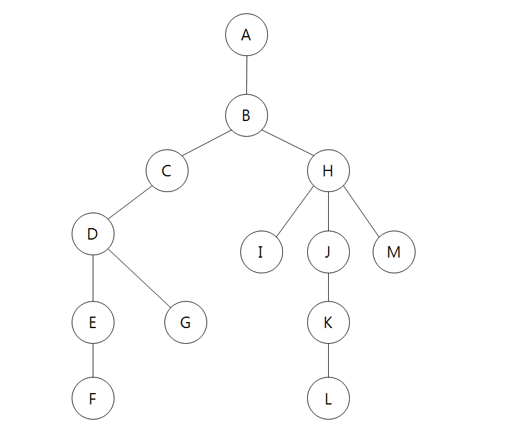

# Trees


DFS: A B C H D I J M E G K F L  
BFS: A B C D E F G H I J K L M

```python
graph = {
    'A': ['B'],
    'B': ['A', 'C', 'H'],
    'C': ['B', 'D'],
    'D': ['C', 'E', 'G'],
    'E': ['D', 'F'],
    'F': ['E'],
    'G': ['D'],
    'H': ['B', 'I', 'J', 'M'],
    'I': ['H'],
    'J': ['H', 'K'],
    'K': ['J', 'L'],
    'L': ['K'],
    'M': ['H']
}
```

### DFS

- Node --> explore children node first --> explore children of children node

```python
def dfs(graph, startNode):
    queue = []
    res = []
    queue.append(startNode)
    while queue:
        val = queue.pop(0)
        res.append(val)
        queue.extend(graph[val])
    return res
```

### BFS

- Node --> explore children of children nodes --> explore children node

```python
def bfs(graph,startVal):
    stack = []
    res = []
    stack.append(startVal)

    while stack:
        val = stack.pop()
        res.append(val)
        stack.extend(graph[val])
    return res

```
